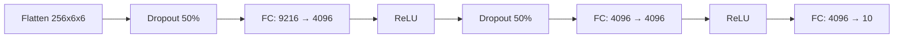

# AlexNet for CIFAR-10 Classification 

## 📖 Overview
This project implements a **modified AlexNet architecture** optimized for classifying images from the CIFAR-10 dataset. Based on the groundbreaking work of Krizhevsky et al. (2012), this implementation adapts the original ImageNet-winning architecture to handle 32×32 pixel images while maintaining the core principles of deep convolutional neural networks.

## 🧠 Key Features
- ✅ **AlexNet architecture** adapted for CIFAR-10
- 🚀 **GPU-accelerated training** with PyTorch
- 🔁 **Data augmentation** (random crops + flips)
- 📉 **Learning rate scheduling** with step decay
- 💾 **Model checkpointing** with best-model saving
- 📊 **Top-1 accuracy** evaluation metrics

## 🏗️ Architecture Overview
The model follows AlexNet's core design principles with modifications for CIFAR-10's 32×32 images:

### 🔍 Feature Extraction Path


### 🧮 Classification Path


## ⚙️ Training Configuration
| Parameter          | Value     |
|--------------------|-----------|
| Epochs             | 20        |
| Batch Size         | 128       |
| Initial LR         | 0.001     |
| LR Decay           | ×0.1 @ epoch 10 |
| Optimizer          | SGD with Momentum (0.9) |
| Weight Decay       | 5e-4      |
| Loss Function      | Cross Entropy |
| Data Augmentation  | Random crops + horizontal flips |

## 🚀 Getting Started
1. **Train the model**:
```bash
python train.py
```

2. **Evaluate the model**:
```bash
python test.py
```

## 📚 References
1. Krizhevsky, A., Sutskever, I., & Hinton, G. E. (2012). [ImageNet Classification with Deep Convolutional Neural Networks](https://papers.nips.cc/paper/2012/hash/c399862d3b9d6b76c8436e924a68c45b-Abstract.html). *Advances in Neural Information Processing Systems*, 25.

2. Krizhevsky, A. (2009). [Learning Multiple Layers of Features from Tiny Images](https://www.cs.toronto.edu/~kriz/learning-features-2009-TR.pdf). *University of Toronto Technical Report*.
